# 📋 TaskMaster

TaskMaster is an Android productivity application built with an offline-first architecture. It helps users organize tasks, manage recurring schedules, track productivity, plan work with a calendar, and synchronize data across devices.

The application is designed using Clean Architecture to keep the codebase modular, maintainable, and scalable.

---

## Features

### Task Management

* Create, edit, archive, and delete tasks
* Categories, tags, and priorities
* Due dates and reminders
* Recurring tasks
* Subtasks

### Productivity

* Focus sessions
* Time tracking
* Daily productivity insights
* Completion statistics
* Productivity trends

### Calendar

* Calendar-based task planning
* Daily schedule view
* Deadline visualization

### Reminders

* Scheduled notifications
* Recurring reminders
* Background reminder service using WorkManager

### Data Management

* Offline-first architecture
* Room database
* Firebase synchronization
* Backup and restore
* CSV export

---

## Architecture

The project follows **Clean Architecture**, separating responsibilities into Presentation, Domain, and Data layers.

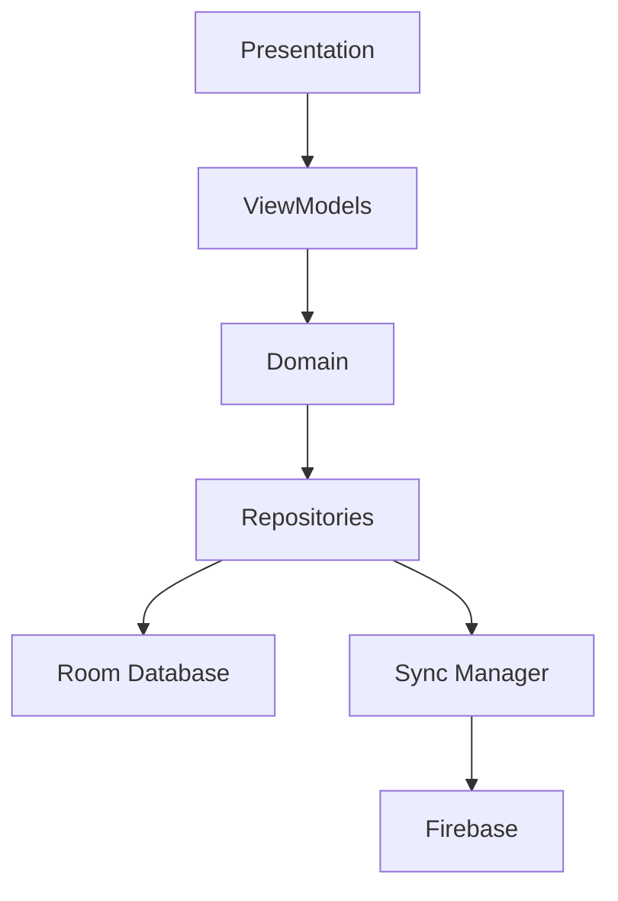

---

## Technology Stack

| Category         | Technology               |
| ---------------- | ------------------------ |
| Language         | Java                     |
| UI               | Android XML              |
| Architecture     | Clean Architecture       |
| Database         | Room (SQLite)            |
| Cloud Sync       | Firebase                 |
| Background Tasks | WorkManager              |
| Notifications    | Android Notification API |
| Navigation       | Navigation Component     |

---

## Project Structure

```text
app/
├── core/
├── data/
│   ├── local/
│   ├── remote/
│   └── repository/
├── domain/
│   ├── model/
│   ├── repository/
│   └── usecase/
├── ui/
│   ├── activities/
│   ├── fragments/
│   ├── adapters/
│   └── dialogs/
├── viewmodel/
└── worker/
```

---

## Application Flow

```text
Create Task
      │
      ▼
Save to Room Database
      │
      ▼
Schedule Reminder
      │
      ▼
User Completes Task
      │
      ▼
Generate Analytics
      │
      ▼
Synchronize with Firebase
```

---

## Planned Features

* Kanban board
* Habit tracking
* AI-assisted scheduling
* Improved cloud backup
* Team collaboration
* Desktop application
* Web application

---

## Screenshots

<p align="center">
  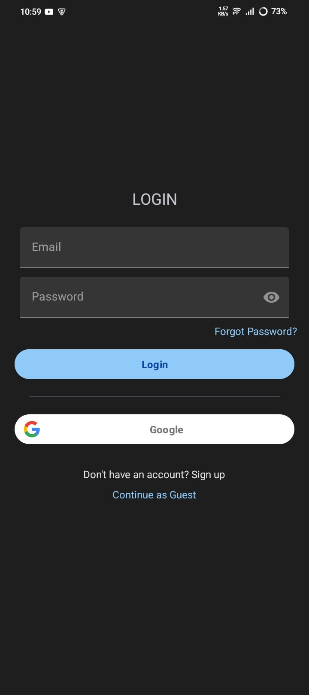
  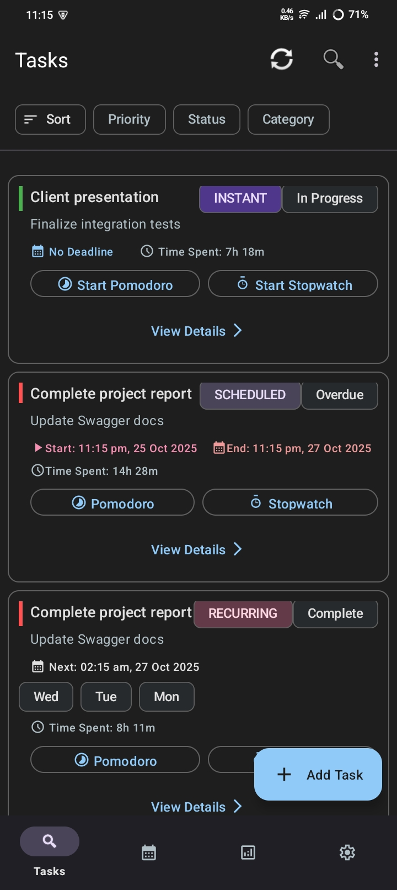
  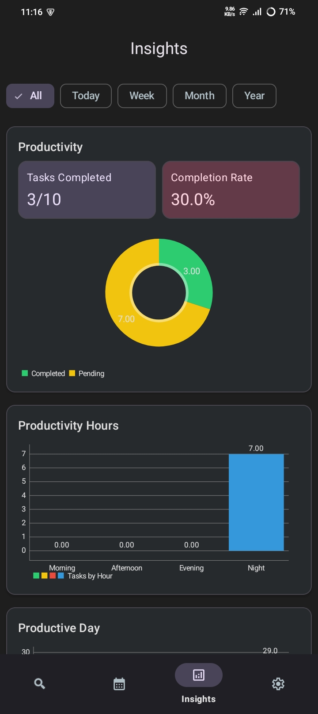
  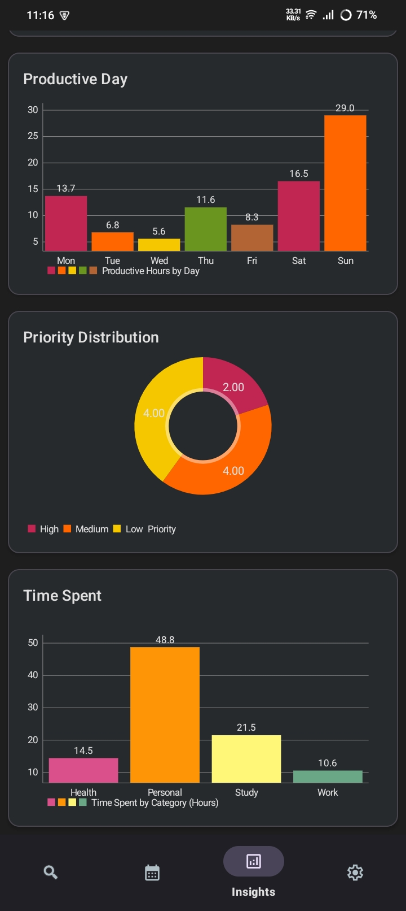
</p>

<p align="center">
  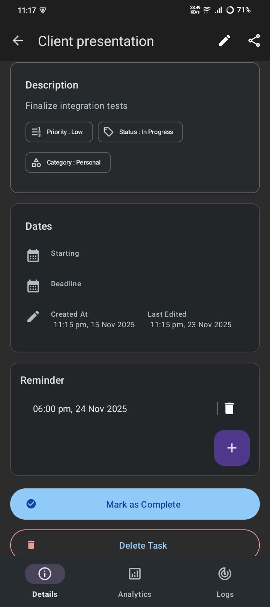
  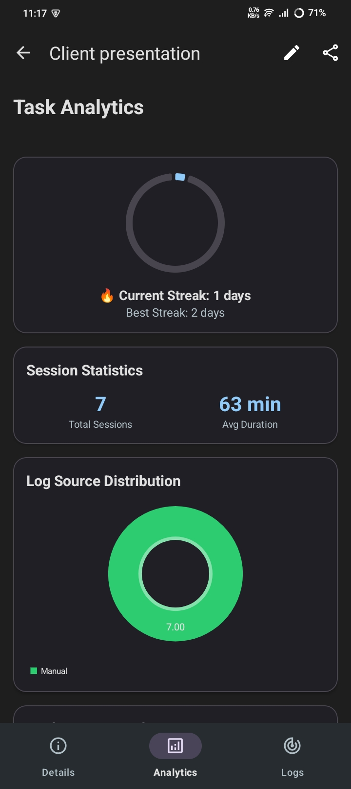
  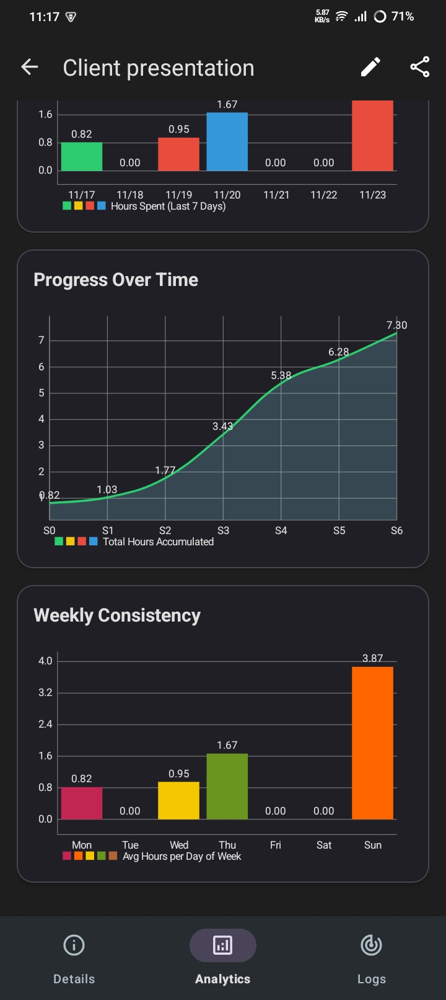
  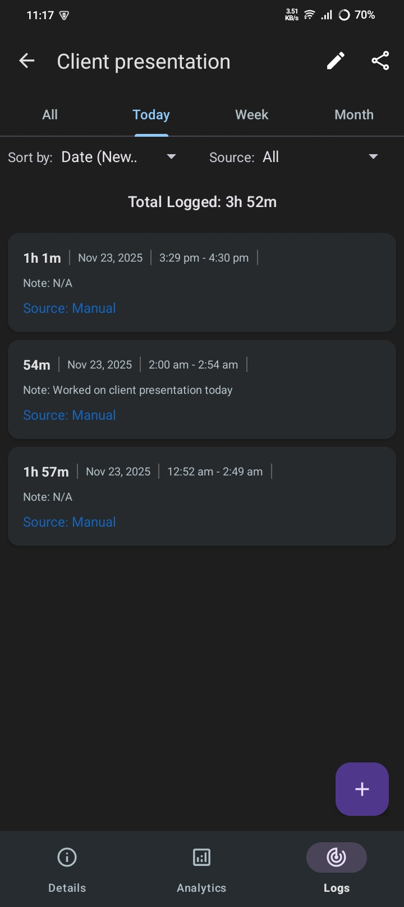
</p>

<p align="center">
  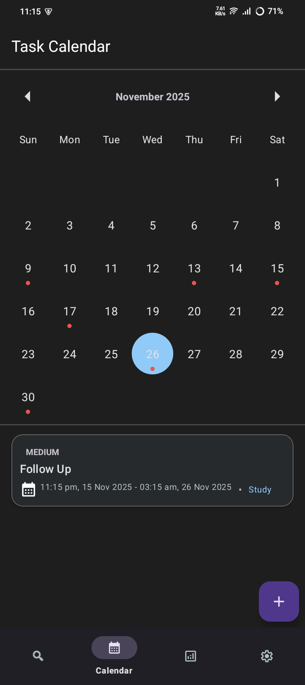
  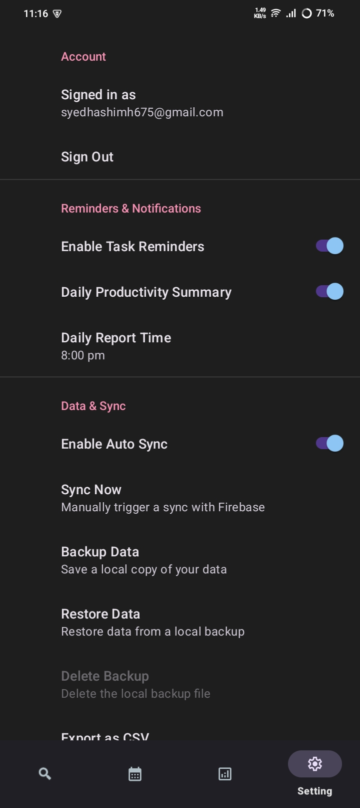
</p>

---

## License

This project is currently **unlicensed**.

All rights are reserved by the author unless a license is added in the future.
