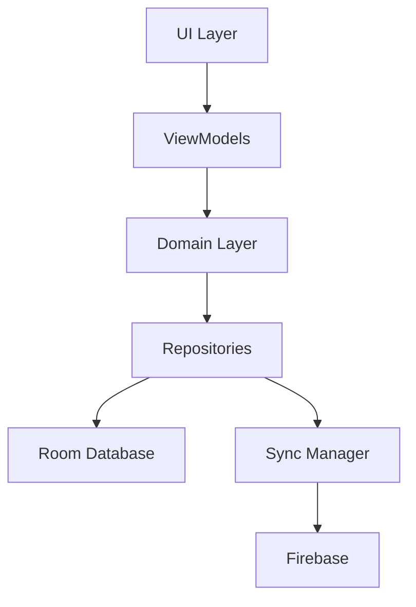

# 📋 TaskMaster

TaskMaster is a comprehensive Android productivity and task management application built around an offline-first architecture.

The application combines task management, reminders, recurring schedules, productivity analytics, calendar planning, focus sessions, synchronization, and reporting into a single productivity platform.

---

## Features

### Task Management

* Create, edit, archive, and delete tasks
* Categories and tagging
* Priority management
* Scheduled tasks
* Recurring tasks
* Subtasks

### Productivity Tracking

* Task completion analytics
* Daily productivity insights
* Productivity trends
* Time tracking
* Focus sessions

### Calendar Planning

* Calendar-based task organization
* Daily scheduling
* Task visualization
* Deadline tracking

### Reminders

* Scheduled notifications
* Recurring reminders
* Background reminder service

### Reports & Analytics

* Daily productivity reports
* Completion statistics
* Time utilization tracking
* Trend analysis

### Data Management

* Offline-first architecture
* Room Database
* Firebase synchronization
* CSV export
* Backup and restore

---

## Architecture



---

## Clean Architecture Structure

### Presentation Layer

* Activities
* Fragments
* Adapters
* ViewModels

### Domain Layer

* Use Cases
* Business Rules
* Analytics Engine
* Domain Models

### Data Layer

* Repositories
* Room Database
* Firebase Services
* Synchronization

---

## Key Modules

### Task Module

* Task creation
* Task editing
* Recurring tasks
* Task details
* Task logs

### Calendar Module

* Calendar planning
* Daily views
* Scheduling

### Analytics Module

* Productivity insights
* Completion statistics
* Trend reporting

### Timer Module

* Focus sessions
* Stopwatch
* Pomodoro workflows

### Sync Module

* Firebase integration
* Offline-first synchronization
* Conflict handling

---

## Technology Stack

| Category         | Technology               |
| ---------------- | ------------------------ |
| Language         | Java                     |
| Architecture     | Clean Architecture       |
| Database         | Room SQLite              |
| Cloud Sync       | Firebase                 |
| Background Tasks | WorkManager              |
| Notifications    | Android Notification API |
| UI               | Android XML              |
| Navigation       | Navigation Component     |

---

## Project Structure

```text
core/
data/
domain/
ui/
viewmodel/
```

---

## Application Flow

```text
Task Creation
      ↓
Local Storage
      ↓
Reminder Scheduling
      ↓
Task Execution
      ↓
Analytics Generation
      ↓
Synchronization
      ↓
Reporting
```

---

## Productivity Features

### Analytics

* Completion rates
* Productivity trends
* Daily performance reports
* Time spent analysis

### Time Management

* Stopwatch
* Focus sessions
* Task duration tracking

### Reporting

* Daily reports
* CSV exports
* Historical logs

---

## Future Roadmap

### Planned

* Cloud backup improvements
* Team collaboration
* Kanban board view
* AI-powered scheduling
* Habit tracking

### Long-Term

* Web application
* Desktop application
* Shared workspaces
* Real-time collaboration

---

## License

Licensed under the MIT License.
